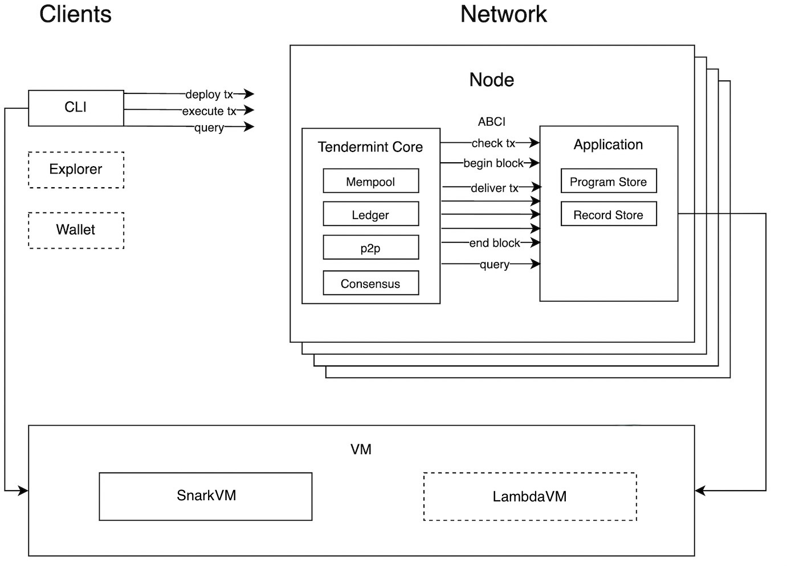

# Aleo Lambda Blockchain

This repository contains a Tendermint implementation of the Aleo verifiable computing model built by [LambdaClass](https://github.com/lambdaclass). Users can run arbitrary private programs off-chain, generate proofs and send them over to a blockchain for transaction storage. 

The current implementation allows for two different VM backends to compile and compute Aleo programs: 
- Our [fork of Aleo's SnarkVM](https://github.com/lambdaclass/snarkVM).
- Our own Aleo [VM implementation](https://github.com/lambdaclass/aleo_vm_lambda) built from scratch.

The consensus/blockchain engine has been built with [Tendermint Core](https://docs.tendermint.com/v0.34/introduction/what-is-tendermint.html).

## Table of Contents  

- [Aleo-Lambda Blockchain](#aleo-lambda-blockchain)
  - [Project structure](#project-structure)
  - [Example application usage](#example-application-usage)
    - [Sending programs and executions to the blockchain](#sending-programs-and-executions-to-the-blockchain)
  - [Other features](#other-features)
    - [Debugging the client/ABCI](#debugging-the-clientabci)
    - [Setting the blockchain endpoint](#setting-the-blockchain-endpoint)
    - [See available CLI parameters](#see-available-cli-parameters)
    - [Execute without changing the state of the blockchain](#execute-without-changing-the-state-of-the-blockchain)
    - [Running multiple nodes on local machine](#running-multiple-nodes-on-local-machine)
    - [Running multiple nodes with Docker Compose](#running-multiple-nodes-with-docker-compose)
  - [Running tests](#running-tests)
  - [Working with records](#working-with-records)
  - [Initialize validators](#initialize-validators)
  - [Adding a node to the network](#adding-a-node-to-the-network)
  - [Design](#design)
    - [Credits and Incentives](#credits-and-incentives)
  - [Implementation notes](#implementation-notes)
    - [Record commitments, serial numbers and validations](#record-commitments-serial-numbers-and-validations)
    - [Other assumptions and known issues](#other-assumptions-and-known-issues)
    - [Reference links](#reference-links)


## Project structure

* [aleo/](./aleo): example aleo instruction programs
* [src/client/](./src/client/): CLI program to interact with the VM and the blockchain (e.g. create an account, deploy and execute programs)
* [src/blockchain/](./src/blockchain/): Implements the [Application Blockchain Interface](https://docs.tendermint.com/v0.34/introduction/what-is-tendermint.html#abci-overview) (ABCI) to connect the aleo specific logic (e.g. program proof verification) to the Tendermint Core infrastructure.
* [src/blockchain/genesis.rs](./src/blockchain/genesis.rs): Implements a helper program that generates JSON files that represent the genesis state for the ABCI app (which Tendermint requires).
* [src/lib/](./src/lib/): Shared library used by the CLI and the ABCI.


## Example application usage

Requires [Rust](https://www.rust-lang.org/tools/install) and [`jq`](https://stedolan.github.io/jq/) to be installed.

Run the ABCI (Application Blockchain Interface) application in a terminal:

```shell
make abci
```

This will have our ABCI app running and ready to connect to a tendermint node:

```
2022-11-07T20:32:21.577768Z  INFO ThreadId(01) ABCI server running at 127.0.0.1:26658
```

In another terminal run the Tendermint node:

```shell
make node
```

This will download and install Tendermint Core if necessary. Alternatively, [these instructions](https://github.com/tendermint/tendermint/blob/main/docs/introduction/install.md) can be used. This will also generate the genesis file for the starting state of the blockchain.
Be sure to checkout version `0.34.x` as current Rust ABCI implementation does not support `0.35.0` (`0.34` is the latest public release).

At this point, both terminals should start to exchange messages and `Commited height` should start to grow. This means the blockchain is up and running. We are now ready to send transactions with the CLI.

Note that you can also [run multiple nodes of the blockchain locally with docker compose](#running-multiple-nodes-with-docker-compose).

### Sending programs and executions to the blockchain

On another terminal, compile the command-line client:

    make cli

Create an aleo account:

    bin/aleo account new

This will generate an account address and the credentials necessary to generate execution proofs, located by default on `~/.aleo/account.json`. This path can be overridden by setting the env var `ALEO_HOME`. Now run the client app to deploy an aleo program:

```shell
bin/aleo program deploy aleo/hello.aleo
```

That should take some time to create the deployment transaction and send it to the Tendermint network. In the client terminal you should see a JSON response similar to the following one:

```json
{
  "Deployment": {
    "deployment": {
      "edition": 0,
      "program": "program hello.aleo;\n\nfunction hello:\n    input r0 as u32.public;\n    input r1 as u32.private;\n    add r0 r1 into r2;\n    output r2 as u32.public;\n",
      "verifying_keys": {
        "hello": [
          "verifier1qqqpqqqqqqqqqqqqs57qqqqqqqqqppfuqqqqqqqqqz32sqqqqqqqqqqrmuqqqqqqqqqzeyqqqqqqqqqqpsqqqqqqqqqqpw8vnp60tq25uf470rmxydj0xjwgwnrkmsvr9s02se3dj4kpawjjxhrx42x28zfa5ayu7ypjvj5zqrsnx8kalm6fh4498er5me7jhdd29l5fplnc4mtawyfjlfldjvzz8q3p..."
        ]
      }
    },
    "id": "7999aa60-ad74-45d2-aa57-f75cb01ac653"
  }
}
```
 You should also see the transaction being received in the ABCI terminal with some message like:

```shell
2022-12-06T19:13:22.456235Z  INFO ThreadId(06) Check Tx
2022-12-06T19:13:22.691738Z  INFO ThreadId(06) Transaction Deployment(7999aa60-ad74-45d2-aa57-f75cb01ac653,hello.aleo) verification successful
2022-12-06T19:13:22.695360Z  INFO ThreadId(07) Committing height 2
2022-12-06T19:13:22.696073Z  INFO ThreadId(06) Check Tx
2022-12-06T19:13:22.876382Z  INFO ThreadId(06) Transaction Deployment(7999aa60-ad74-45d2-aa57-f75cb01ac653,hello.aleo) verification successful
2022-12-06T19:13:23.857425Z  INFO ThreadId(07) Deliver Tx
2022-12-06T19:13:24.066973Z  INFO ThreadId(07) Transaction Deployment(7999aa60-ad74-45d2-aa57-f75cb01ac653,hello.aleo) verification successful
```

This means that the program was deployed succesfully and stored on the blockchain. If you tried to redeploy it, you would see the following error message:

```shell
{
  "error": "Error executing transaction 1: Could not verify transaction: Program already exists"
}
```

Notice that transaction JSON includes an `id` field which you can retrieve by running `bin/aleo get {transaction_id}`. It will retrieve the same JSON from the blockchain if you run it.

Finally to execute a program (locally) and send the execution transaction (with its proof) run in client terminal:

```shell
bin/aleo program execute aleo/hello.aleo hello 1u32 1u32
```

The command above will run the program and send the execution to the blockchain:

```json
{
  "Execution": {
    "id": "15499c5b-b0b7-46eb-87da-366f38cc485c",
    "transitions": [
      {
        "fee": 0,
        "function": "hello",
        "id": "as1f0y0080cuvfnz5rwdm4yk90ny7pghqfxa42kg37jv403ccpvzqfquftums",
        "inputs": [
          {
            "id": "525052707127338880162170750843371169229438004982085783899427530567050481836field",
            "type": "public",
            "value": "1u32"
          },
          {
            "id": "4717481540194483200902154787515383856547973389698044767020383141679731034593field",
            "type": "private",
            "value": "ciphertext1qyq87903rnzu2va44zq985y0cqltr4uhkftwnqlvtsdfzwxd8cr5syqcnmfum"
          }
        ],
        "outputs": [
          {
            "id": "6029120002360365362314373657798705508848679817835900143138007626549923986692field",
            "type": "public",
            "value": "2u32"
          }
        ],
        "program": "hello.aleo",
        "proof": "proof1qqqqzqqqqqqqqqqqm0t60gjwk8k9.....",
        "tcm": "2845314139032602383675815349790318009604197052650910442608790130653723629069field",
        "tpk": "5997679097582981876126538929314854897856654620144767419232361193165432492135group"
      }
    ]
  }
}
```
Again, we see the transaction (of type `Execution`) and its ID, which means the execution was sent out to the network sucesfully.

After each execution, Tendermint node may be left in an invalid state. If that's the case run:

```shell
make reset
```

to restore the initial state. Notice that this will delete the databases that store the programs and the records, so previous deployments and account records will be deleted.

## Other features

### Debugging the client/ABCI

By default, the CLI will output no more data than a JSON response. To enable verbose output, you can pass the `-v` flag to see logs up to the level that you have set on the env var `RUST_LOG`. The same applies for the ABCI.

### Setting the blockchain endpoint

By default, the CLI client sends every transaction to `http://127.0.0.1:26657`, which is the local port for the ABCI application. In order to override this, you can set the env var `BLOCKCHAIN_URL` or alternatively, you can pass `-url {blockchain_url}` in the commands.

### See available CLI parameters
In order to see all different commands and parameters that the CLI can take, you can run `bin/aleo --help`.

### Execute without changing the state of the blockchain

You can execute programs in the way as you normally would but without sending the proofs to the blockchain by using the `--dry-run` parameter: `program execute aleo/hello.aleo 1u64 1u64 --dry-run`. This will display the same output as normal, and will also attempt to decrypt output records with the active credentials.

### Running multiple nodes on local machine	

There is a set of *make commands* to create the configuration of a local testnet (localnet) of several nodes.	

```	
make localnet VALIDATORS={N}	
```	

Will create one specific directory for the configuration of N (default 4, max 10) nodes under directory `localnet`	

For each node it will create `config` and `data` directories to support tendermint function, and an `abci` directory to allow each `snarkvm_abci` instance run in its own directory.	

For each node it will assign a different set of ports for the tendermint and abci processes: For node N, the used ports will be 26{N}56, 26{N}57 and 26{n}58. Eg. for node 0 the ports will be 26056, 26057 and 26058.	

The `make localnet` command will create the specific configuration for each node including the updated persistent_peers so they see each other once run.	

It also will delete any previous configuration, so it can be used to reset the localnet as well.	

To start each node run in different terminals:	
```	
make localnet_start NODE={N}	
```	

This will start the `tendermint` process as well as the `snarkvm_abci` process in the same terminal (So logs can be a bit messy)	

Once all the nodes are started the network will be ready to interact.	

Note that each node will require more than 2Gb to run so it can get a bit eager on memory. Also note that 3 nodes is the minimum for tendermint to work, so 4 is the minimum to let it work and tolerate one validator failing.	

Thus, you can interact with the network from another terminal like this:	

```	
ALEO_HOME=localnet/node1/ bin/aleo --url http://127.0.0.1:26157 account balance	
```	

making sure the port matches the node being hit.	

To stop the localnet, `Ctrl+C` on each node terminal should end both the `abci` and the `tendermint` processes, but in case something doesn't go as expected, `ps aux | grep tendermint` and `ps aux | grep abci` will allow locate and kill any remaining process.	

### Running multiple nodes with Docker Compose

*Note: Currently, localnet commands described in previous section are preferred instead of docker counterparts, as have been tested recently. However we leave this section just in case docker is required of preferred.*

This requires having docker (with docker-compose) installed.

Then build the `snarkvm_abci` image:

```shell
make localnet-build-abci
```

And to start the test net run:

```shell
make localnet-start
```

Note that each node will require more than 2Gb to run so docker should be configured to use 10Gb or more in order to work with the default 4 nodes.

To modify the configuration you should edit `docker-compose.yml` file

The configuration mounts some volumes in the `testnet/node{_}/` directories, and in case the tendermint nodes state needs to be reset, just run:

```shell
make localnet-reset
```

or delete all the `node{_}` dirs to remove local `snarkvm_abci` data (it will require to download all the parameters on next run).

You will find an `account.json` file in each `testnet/node{_}/` directory, with the aleo credentials of the validators (usable to run commands with the credits of the validators). On a MacOS docker deploy, each of the 4 testnet nodes will be exposed on ports 26657, 26660, 26663, 26666 of localhost.

Thus, you can interact with the network from the host like this:

```shell
ALEO_HOME=testnet/node1/ bin/aleo --url http://127.0.0.1:26657 account balance
```

This requires having docker (with docker-compose) installed.

Then build the `snarkvm_abci` image:

```
make dockernet-build-abci
```

And to start the test net run:

```
make dockernet-start
```

Note that each node will require more than 2Gb to run so docker should be configured to use 10Gb or more in order to work with the default 4 nodes.

To modify the configuration you should edit `docker-compose.yml` file

The configuration mounts some volumes in the `dockernet/node{_}/` directories, and in case the tendermint nodes state needs to be reset, just run:

```
make dockernet-reset
```

or delete all the `node{_}` dirs to remove local `snarkvm_abci` data (it will require to download all the parameters on next run).

You will find an `account.json` file in each `dockernet/node{_}/` directory, with the aleo credentials of the validators (usable to run commands with the credits of the validators). On a MacOS docker deploy, each of the 4 testnet nodes will be exposed on ports 26657, 26660, 26663, 26666 of localhost.

Thus, you can interact with the network from the host like this:

```
ALEO_HOME=dockernet/node1/ bin/aleo --url http://127.0.0.1:26657 account balance
```

## Running tests

In order to run tests, make sure the ABCI and the Tendermint Node are currently (`make abci` and `make node` respectively) running locally, and run `make test`.

## Working with records

In order to work with records, there are some things to keep in mind. As an example, we can use the `aleo/token.aleo` program. Deploy the program by running `bin/aleo program deploy aleo/token.aleo` and then do:

```shell
program execute aleo/token.aleo mint 12u64 {address}
```

````json
{
  "Execution": {
    "id": "13a6e12f-c1be-46ce-b88e-9f3d74c7f9f5",
    "transitions": [
      {
        "fee": 0,
        "function": "mint",
        "id": "as1cektpje7mvrpgx4hawwdgfdgtw3yssfka282mpxaka8wcwmmhuyq8r3tf8",
        "inputs": [
          {
            "id": "1903280603122117322278162275809747610855764299760927153918643421395521073298field",
            "type": "private",
            "value": "ciphertext1qyqfajapluev4msjwzzptsymq4l0wl329krz6jqspmxz22leek7ljzsnq8nuh"
          },
          {
            "id": "3522127154863327477692820168234451494875264297697436450178817817644445199141field",
            "type": "private",
            "value": "ciphertext1qgqfmm7w6xztayz66ua54f7se899gusalx7540tavay508gcxndsjq5us4ncksafshdl4kfcwdgana8sp6ttnaj27t7m4t4pkq7tpvw4qgz20wda"
          }
        ],
        "outputs": [
          {
            "checksum": "662823924611211467835113438946492963566923769790927177001971226066013541277field",
            "id": "7219462448732480752053359377653342974759175543229460809950854209290642964685field",
            "type": "record",
            "value": "record1qyqsqtve8kg9afk6vzva3cpar5jztamahh38l75v6fzjee0te72xdfs0qyqsp0yrkua473w430zkrdls9ndreg8ucg7swph8zref9hem6e7pmdg8qyqqvctdda6kuaprqqpqzqq78dw4y06ax8l0fs49txvf0n0azx7ue6guhld7c5ecxtxexujjzymnlltl8hac9cy0vr0d6xd6fc6gqhfn3znfa4vcz22jrtyqax2s2gkz2mv"
          }
        ],
        "program": "token.aleo",
        "proof": "proof1qqqqzqqqqqqqqqqq0t0lajnnm",
        "tcm": "3029182936031307181714700392868610826830807174425109386666072696640639657186field",
        "tpk": "3762006807277732897697753651971484341155898222134947549896413876819808587029group"
      }
    ]
  }
}
````

You can use your address from the account creation here. You can see the output contains a record, which you can use in further executions such as the function `transfer_amount` from the same aleo program by passing the value `record1qyqsqtve8kg9afk6vzva3cpar5jztamahh38l75v6fzjee0te72xdfs0qyqsp0yrkua473w430zkrdls9ndreg8ucg7swph8zref9hem6e7pmdg8qyqqvctdda6kuaprqqpqzqq78dw4y06ax8l0fs49txvf0n0azx7ue6guhld7c5ecxtxexujjzymnlltl8hac9cy0vr0d6xd6fc6gqhfn3znfa4vcz22jrtyqax2s2gkz2mv` as the parameter.

## Initialize validators

In order to initialize the necessary files that would be required on a testnet, you can run:

````shell
make VALIDATORS=3 testnet
````

This will create subdirectories in `/mytestnet/` for each of the validators (defaults to 4 if it's not passed as a parameter). This means that there are files for the private validator keys, account info and genesis state. This way the nodes are able to translate a tendermint validator address to an aleo account, which in turn are used to generate reward records.

## Adding a node to the network

Once a network is up and running, you can add new nodes. In general, nodes in the network can work in two different modes:

- Non-validator: The node catches up with the blockchain by performing every transaction, but does not have voting power for validating and commiting blocks
- Validator: The node is part of the network, and can vote and sign blocks

Adding a non-validator node with Tendermint Core is simple: You need to provide the appropriate `genesis.json` file (you can copy it from the network nodes), and update the `persistent_peers` field in the `config.toml` file (by default on the `.tendermint` directory) to point to the fixed seeds (you can also get this from the one of the network's `config.toml`). 
You can also just copy the whole file if every other setting such as sockets, timeouts, etc. are expected to be default. Once this is done, you can run `bin/tendermint node` to run the node code on one terminal and `make abci` on another to make sure the ABCI runs alongside Tendermint. If all is well configured, you should see the Tendermint node connecting to the ABCI, succesfully parsing the `genesis.json` and replaying the transactions that it gets from the `persistent_peers`. 
If reading the logs from the remote logs, you will also see the new node's connection incoming. You can read more about the config on the [Tendermint docs](https://github.com/tendermint/tendermint/blob/release/v0.34.13/docs/tendermint-core/using-tendermint.md#adding-a-non-validator).

In order to transform the node into validator, we need to give it voting power. This is implemented on our ABCI's [`EndBlock`] hook(https://github.com/tendermint/tendermint/blob/main/spec/abci/abci.md#endblock). 
To update its voting power, you need to stake credits to its public key (an Ed25519 public key located in `.tendermint/config/priv_validator_key.json`), which means you need to transfer valid credits to the address associated with the new node (usually located in `/.tendermint` if the config was initialised with the make targets, but it can be any valid Aleo address). An example stake transaction looks like this:

```shell
ALEO_HOME="/Users/admin/.tendermint" bin/aleo credits stake 40 record1f2D... jDKxY+9XKM02u1jRQea4dV3UKjuZ4Pqfe3vtswkF0xE=
```

- Notice that we are setting ALEO_HOME so that the account located in that directory is performing the stake, but as mentioned, any valid Aleo address will work as long as it is the owner of the spent record
- `record1f2D...` should be an unspent record's ciphertext associated to the address in the `.tendermint` directory
- `jDKxY+9XKM02u1jRQea4dV3UKjuZ4Pqfe3vtswkF0xE=` is the public key associated with the Tendermint node

This will associate the Tendermint public key to the Aleo address in all the blockchain nodes, so that they can appropriately assign credits to it in each round. You can read more about staking in the [staking section](#staking).

Note that the code relies on voting power for a given round as informed by Tendermint as opposed to using the one that we track internally. This is because the voting power on the informed round may not be the same as the last known one (e.g. there could be staking changes already applied to our internal data structures that will take some rounds before affecting the consensus voting). For example, if you unstake all credits from an account, you will see the its balance increase for a couple of blocks after unstaking because the changes are not committed immediately by design.

## Design

The diagram below describes the current architecture of the system:



* The blockchain nodes run in a peer to peer network where each node contains a Tendermint core and an application process.
* Tendermint core handles the basic functions of a blockchain: p2p networking, receiving transactions and relying them to peers, running a consensus algorithm to propose and vote for blocks and keeping a ledger of committed transactions.
* The application tracks application-specific logic and state. The state is derived from the transactions seen by the node (in our case, the set of spent and unspent records, and the deployed program certificates). The logic includes validating the execution transactions by verifying their proofs.
* The application is isolated from the outer world and communicates exclusively with the tendermint process through specific hooks of the Application Blockchain Interface (ABCI). For example: the `CheckTx` hook is used to validate transactions before putting them in the local mempool and relaying them to the peers, the `DeliverTx` writes application state changes derived from transactions included in a block and the `Commit` hook applies those changes when the block is committed to the ledger.
* The ABCI application contains two components related to maintaining the state of the blockchain network: The program store and the record store. As their names imply, they are in charge of persisting and retrieveing programs that have been committed by users and keeping track of records and their spending status respectively.

These interactions between tendermint core and the application are depicted below:


For a diagram of the the consensus protocol check the [tendermint documentation](https://docs.tendermint.com/v0.34/introduction/what-is-tendermint.html#abci-overview).

Below are sequence diagrams of deployment and execution transactions.

### Credits and Incentives
This project intended to implement _the simplest thing that could possibly work_ to get a Proof of Stake blockchain using aleo credits and a shielded record model.

#### Credits
As in SnarkVM and, by extension, SnarkOS, this project relies on a special `credits.aleo` program to handle all operations with the official aleo currency. While this program has special treatment, in this case it differs from SnarkVM in that its sourcecode is not embedded in the vm library nor its keys downloaded remotely. The file is assumed to be [available locally](./aleo/credits.aleo) when compiling the code and it can be modified as the rest of the codebase. It's assumed that the client and the ABCI application will have been compiled with the same version of the credits source code.

The credits program defines a [credits record](https://github.com/lambdaclass/aleo-consensus/blob/7cbaea3d43589804c34e1b7dce9a1b13025ce09a/aleo/credits.aleo#L3-L5), which has an owner address and the amount of `gates` the record contains. The gates are the currency in aleo programs. The program also exposes a few functions related to credits management, e.g. to transfer gates, combine or split records and to pay fees for transactions (see below). Those functions are, in turn, [exposed as subcommands](https://github.com/lambdaclass/aleo-consensus/blob/7cbaea3d43589804c34e1b7dce9a1b13025ce09a/src/client/commands.rs#L38-L118) in this project's CLI.

The source code for the credits program from this repository, compared with the one in SnarkVM, introduces a new record type and a couple of extra functions specific for staking of credits through a validator. These will be discussed below.

#### Fees
The fee of a given transaction is calculated as the difference between the input record gates and output record gates of all transitions contained in the transaction. In pseudocode:

``` python
input_gates = 0
output_gates = 0
for transition in transaction.transitions():
    for input_record in transition.input_records():
        input_gates += input_record.gates()
    for output_record in transition.output_records():
        output_gates += output_record.gates()
fee = input_gates - output_gates
```

The fee doesn't just destroy credits; the paid amount will be distributed among the validators as rewards regenerated in new records by the blockchain (see below). A transaction that has negative fee (more output than input gates) would be one that attempts to "create money", so even if a client could produce one, it would be rejected by the blockchain as invalid. In this system credits can only be created at genesis or through validator rewards and both happen programatically (not through execution of credit functions).

Note that for a program deployment transaction there's no circuit execution (there's no input and output records in the act of sending a program to the blockchain), and for program execution transactions, even though there are inputs and outputs records they won't typically involve changes in the balance of gates. For this reason, the blockchain allows to include a separate transition specifically to force the desired difference in input/output gates. This transitions is effectively an execution of [the fee function of the credits program](https://github.com/lambdaclass/aleo-consensus/blob/7cbaea3d43589804c34e1b7dce9a1b13025ce09a/aleo/credits.aleo#L43-L48), which just subtracts an arbitrary amount of gates from an input record.

Thus, a deployment that pays 2 gates in fees command would look like:

    bin/aleo program deploy aleo/hello.aleo --fee 20 --fee-record record1qyqsp6aue3dtlvwwe7j43hl9j098n0kwjdc2ngy488z4ztc2a0sflfgjqyqspuw2ksaaj6pzatzkcwaa8utngen9us3rcwh9j87mlm3zv0xm7gsyqqqqshgw3x9udlmvppt0mjwq7z7gw80g0hl4m2mwcega4n8pqgy66zqa77wzm

And an execution:

    bin/aleo program execute aleo/hello.aleo hello 1u32 2u32 --fee 10 --fee-record record1qyqsp6aue3dtlvwwe7j43hl9j098n0kwjdc2ngy488z4ztc2a0sflfgjqyqspuw2ksaaj6pzatzkcwaa8utngen9us3rcwh9j87mlm3zv0xm7gsyqqqqshgw3x9udlmvppt0mjwq7z7gw80g0hl4m2mwcega4n8pqgy66zqa77wzm

Note that we if omit the `--fee-record` argument, the CLI program will try to figure one out from the unspent records in the current account.

The fee also determines the priority of the transaction within the blockchain nodes mempools; higher paying transaction should ideally be processed first. This is controlled in the [ABCI application hooks](https://github.com/lambdaclass/aleo-consensus/blob/7cbaea3d43589804c34e1b7dce9a1b13025ce09a/src/blockchain/application.rs#L130-L133) but note that its support by tendermint is limited and subject to change in future versions. More details [here](https://github.com/tendermint/tendermint/discussions/9772).

#### Rewards
In addition to the fees collected from transactions, there's a baseline amount of gates generated on each block.
(At the moment this baseline is [fixed at 100 gates](https://github.com/lambdaclass/aleo-consensus/blob/4e4a5999ccf44c961f42161a268c5f8780f286f1/src/blockchain/validator_set.rs#L10-L12) per block, but that could easily be made configurable or even reduce it progressively based on the block height).

The baseline credits and transaction fees make the block rewards, to be distributed among the network validator nodes.
The current algorithm gives roughly half to the current block proposer and distributes the other half among the validators that signed the previous round's block,
weighted by their voting power (which, in turn, is proportional to their staked credits as explained in the next section). Since this weighted distribution
may produce leftovers from rounding errors, those are assigned to the proposer to ensure no credits are lost.

At the end of the block processing, the rewards are distributed by minting records of the credits program for each validator, setting the validator aleo address as the owner.
Some notes about this process:
* For this to be possible, a mapping between tendermint validator address and aleo account is tracked by the blockchain.
* Because all nodes participating in consensus need to produce the same records on-chain, and because records require a random nonce to prevent hash collisions, for this particular case the nonces are generated deterministically from a known seed. This implementation uses the [block height as the seed](https://github.com/lambdaclass/aleo-consensus/blob/4e4a5999ccf44c961f42161a268c5f8780f286f1/src/blockchain/validator_set.rs#L242).
* These records will be added to the record store at the end of block processing (see the design section). Note that this is ABCI application state that, even though not stored in the tendermint blockchain directly, is derived deterministically from the transaction ledger.
* Despite the records being shielded in the blockchain, there is some level of privacy leakage in the sense that anyone running an honest node can inspect which aleo account gets which amount of rewards. This is a necessary consequence of the consensus algorithm.

The relevant reward generation code can be found [here](https://github.com/lambdaclass/aleo-consensus/blob/HEAD/src/blockchain/validator_set.rs#L180-L253).

#### Staking
The validator nodes in the network have an associated voting power which determines their weight in the tendermint consensus protocol. Proof of Stake is implemented by exposing a mechanism to exchange aleo credits with voting power points, and informing those changes to the tendermint core layer through the ABCI interface.

A few changes have been introduced to the `credits.aleo` program to implement staking through program execution (with its associated proofs verified by the blockchain):

* A new [staked_credits record type](https://github.com/lambdaclass/aleo-consensus/blob/4e4a5999ccf44c961f42161a268c5f8780f286f1/aleo/credits.aleo#L7-L9), which is used as a way to "put credits aside" in exchange of voting power. (see [this task](https://trello.com/c/XszNFTYN/212-verify-that-credits-records-cant-be-used-interchangeably) to verify some assumptions around this decision).
* A [stake function](https://github.com/lambdaclass/aleo-consensus/blob/4e4a5999ccf44c961f42161a268c5f8780f286f1/aleo/credits.aleo#L50-L60) used to move an amount of aleo gates from a credits to a staked_credits record. In addition to generating output records, there are a number of public output values used by the nodes to update the validator state: the amount staked and the aleo account address doing the staking (the aleo address for the validator is necessary to know what owner to use for the reward records).
* [An unstake function](https://github.com/lambdaclass/aleo-consensus/blob/4e4a5999ccf44c961f42161a268c5f8780f286f1/aleo/credits.aleo#L62-L72) used for the inverse operation: moving gates back from staked_credits to credits. It is worth noting that this unstake operation takes as an input one of the records that are created by the stake function.
* In order to avoid unstaking credits from validators that were originally staked to different validators, the Public Key needs to be embedded in the `staked_credits` records. Because there is no specific data type that adjusts to this need, the tendermint validator Public Key is passed to aleo instructions through two `u128` literals. The key is both embedded in the records and also output as a public value for the blockchain to adjust voting power accordingly.


The CLI, in turn, exposes a couple of commands to handle execution of those functions:

    bin/aleo credits stake 50 record1qyqsqa2luw8spua6us6y56t9gfv7fqrg93dtpf7z7kglykf3s3q4pwcgqyqsqxuprwvqcl8s3f3vmcch329e28cy80duxmeu42wkswex03d6urgdqqqpw66xrpzhpj0ujp5susqu6u4zwkr5alpx26x4ugyz5qvkfenz6pc5sqpae fWT3sfhFB2Xgi3Uo7rKam1mLisbRc78Knw4as6vSIQw

    bin/aleo credits unstake 50 record1qyqsqa2luw8spua6us6y56t9gfv7fqrg93dtpf7z7kglykf3s3q4pwcgqyqsqxuprwvqcl8s3f3vmcch329e28cy80duxmeu42wkswex03d6urgdqqqpw66xrpzhpj0ujp5susqu6u4zwkr5alpx26x4ugyz5qvkfenz6pc5sqpae

In the first example, the last argument `fWT3sfhFB2Xgi3Uo7rKam1mLisbRc78Knw4as6vSIQw` corresponds to a Tendermint validator node public key, so when e.g. a stake execution is accepted by the blockchain, the amount of staked credits is extracted from the transition outpus, converted to Tendermint voting power and passed over to Tendermint core in the [end_block ABCI hook](https://github.com/lambdaclass/aleo-consensus/blob/HEAD/src/blockchain/application.rs#L241-L259).

In the second example, the validator public key is not included as an argument because it is taken from the input record (which is the output of a staking operation).

In the Tendermint core side, the [behavior](https://github.com/Tendermint/Tendermint/blob/v0.34.x/spec/abci/apps.md#endblock) of voting power changes is:

* if power is 0, the validator must already exist, and will be removed from the validator set
* if power is non-0:
  * if the validator does not already exist, it will be added to the validator set with the given power
  * if the validator does already exist, its power will be adjusted to the given power
* The updates returned in block H will only take effect at block H+2.

Notice that this model assumes that only one aleo account per validator is doing staking. In the future this could be changed to have multiple aleo accounts delegate their stake to the node, which could also be a means to increase the privacy of stakers.

#### Genesis block
The genesis block of Tendermint blockchains is setup via a [genesis.json file](https://docs.Tendermint.com/v0.34/Tendermint-core/using-Tendermint.html#genesis) in the Tendermint home directory. Its `"app_state"` field is used to pass arbitrary initialization data to the ABCI application, read in the [init_chain hook](https://github.com/lambdaclass/aleo-consensus/blob/HEAD/src/blockchain/application.rs#L32-L54). This is currently being used to set an initial list of validator nodes, the mapping of validator public keys to aleo accounts to be used as reward record owners and a list of default records to be stored in the record store for an initial supply of aleo credits to circulate (in addition to the baseline credits that will be generated on each new block). The app state for a 4 validator testnet looks like this:

``` json
{
  "records": [
    [
      "995843508827021426686846432791510729332874282829406919322413902062082943379field",
      "record1qyqsqgr22ruzvvs4dd4jledgtm32yqcutg7np8fep96euk6kkghrmfc0qyqsq2uh265ge38024fvarax6gsgt6rpqmlh5l088lrvyyvka6l4vssdqqqz42k2ksg2dfrkjx0gyw4q2wmqzlsrnhtnx56qhke9eswppdwxzpswmmn7g"
    ],
    [
      "2264356548447192630929650967676395533434571554981138498868702632504771573024field",
      "record1qyqsql0swgv9zn6yh242f68egkc8n2za7ne2yscvc2dyegrm5ncezmc8qyqsqp42p2sa70q4c9xf2gd470yaxk0kfsknpxl4qdy3j860r4tzmusqqqqz42k2ksg2dfrkjx0gyw4q2wmqzlsrnhtnx56qhke9eswppdwxzpsxevchr"
    ],
    [
      "3492975133342259069417365485621891453474537488114128210079348858970592471061field",
      "record1qyqspgfy4f5fr4px4k0r2e4tkrzkw5xvxtqcenrdzatluttklcuu2jq2qyqsq7czdzruuqczdvuum5n6ldt0y6jst3cxcr9m9fate9n3khjtkms8qqqz42k2ksg2dfrkjx0gyw4q2wmqzlsrnhtnx56qhke9eswppdwxzps7zcfgy"
    ],
    [
      "607190142347952694676338617406100632628856569133166444244991178316351389454field",
      "record1qyqspvuxzqrlrg7xpxgn0lpzmu0edfvpf8amcnn4vcknwswcw4g8r7czqyqsp5se7suks05ffnr46d72pawcxlsevcq6rwp6amq3fncl7ee7lscpqqqz42k2ksg2dfrkjx0gyw4q2wmqzlsrnhtnx56qhke9eswppdwxzpszacmn3"
    ]
  ],
  "validators": {
    "3gx3phUFxwY48Ljz53Ahlo+oo4oQbmQj8OMyT9/FHxk=": "aleo1c9mraqzhtnquyqyfn4zq0j5xshfhg44l7wsljth03mlyyhs79uqsplx0cz",
    "92RH2EgC60bUXJJIZ9Ydf263DC6cFqUJmc0KIj1QmyU=": "aleo176p600nn7tfjmqz7w3nnhk52nkv9q4hxr6egqla7vccr3j3egufqxmkknr",
    "emzCjJkMYoChAqJZ0jDSBOJ+GGzrXyIeHjn7tigJ9F8=": "aleo1j5tvlnjeq7dgals8gygwm62wy3xtlvklylufgkelfnnqzxlccugscajp5m",
    "u1fD6AirUjjwztegMwRAXL5aMFmDqt7Zp6y459a0RJY=": "aleo1lx7k2hy9mqtjtulcht0gtw8javp5dwd86z7ffchxzfaep5qcvq8s4xwyzx"
  }
}
```

New validators can join the network after genesis by staking credits as described in the previous section.

There's a [genesis program](https://github.com/lambdaclass/aleo-consensus/blob/HEAD/src/blockchain/genesis.rs) used to generate this app state and a [make target](https://github.com/lambdaclass/aleo-consensus/blob/4e4a5999ccf44c961f42161a268c5f8780f286f1/Makefile#L44-L54) to initialize Tendermint testnets with a valid genesis.

#### Slashing
At the moment there's no validator slashing implementation. The Tendermint abci hooks [provide information](https://github.com/Tendermint/Tendermint/blob/v0.34.x/spec/abci/abci.md#beginblock) to infer if a validator has deviated from the protocol, but custom application logic would need to be added to punish those validators by subtracting credits (which may require some changes in the current design).

## Implementation notes

### Record commitments, serial numbers and validations
The record store contains a DB of all existing records (essentially output records, with ciphertexts and commitments from executions), and a DB of spent records. Keeping track of the existence of records (along with their spent status) by using commitments is a security concern since it reveals data by enabling the possibility of linking records to users. Because of this, there is a need to track spending status of records by using their serial numbers (essentially records 'signed' by the user's private key used as inputs of executions). [This thread](https://forum.zcashcommunity.com/t/how-does-a-node-verify-a-nullifier-without-reveal-its-relation-to-its-correspond-commitment-in-zcash/20124) describe this model as used by Zcash.

*  This means that getting records owned by a user is not trivial since we need to get all records and produce serial numbers to cross-check with thespent serial number DB.
* Because we track the existence of records by their commitments and there is no way for the blockchain to relate them to a serial number, the current implementation does not enforce that the serial number that is an input on an execution does actually exist and is valid (for now, it is assumed to exist always). In order to solve this, there needs to be a proof included that shows that there is a valid merkle path to a record used as an input (currently not implemented).

The [previous implementation](https://github.com/lambdaclass/aleo-consensus/pull/80) favored integrity over privacy by storing separate list of spent and unspent commitments, so the blockchain could check that input records previously existed in the blockchain (and weren't already spent). This may be considered a better provisional solution until the merkle path proofs are incorporated.

The proof of stake implementation works under the assumption that records are strongly typed, i.e. a record generated in one program can't be input to another, even if its member match; and another program can't just import the original and add arbitrary operations over the record. In particular, it's assumed that staked_credits records can't be used elsewhere in aleo programs, only to unstake voting power and receive credits in exchange. If this violates the current aleo model (as recent experimentation suggest), at least these options could be considered:

* Add some sort of typing to the records (maybe optional?): include the program and record name as part of the record, and make the execution proofs verify them.
* Stop using the staked_credits for staking, and rely entirely on the validator set to check that only existing voting power can be unstaked (and generate credits accordingly).

This work is captured in [this ticket](https://trello.com/c/XszNFTYN/212-verify-that-credits-records-cant-be-used-interchangeably).

### Other assumptions and known issues
* The [vm module](https://github.com/lambdaclass/aleo-consensus/blob/c5792f44df0a74b4eb56afdb324610f062f03904/src/lib/vm/mod.rs#L253-L283) of this project contains most interactions with SnarkVM (and it's planned to similarly contain the analog operations from [VMentropy](https://github.com/lambdaclass/VMtropy)). Note that part of the API of the module are ad hoc function to meet specific requirements without having to change or dig too deep in SnarkVM. Parts of SnarkVM were ported or circumvented, so there may be some implicit cryptographic assumptions that are not being met.
* Transaction ids are generated as sha256 hashes of the transaction data, which allows integrity verification on the blockchain side. The use of merkle trees to generate the ids as previously done by SnarkVM was considered unnecessary for the purposes  this project.
* The [thread rng](https://docs.rs/rand/0.5.0/rand/fn.thread_rng.html) is used in most places where SnarkVM interactions required random number generation. This may need to be revised for security.
* SnarkVM generates certificates along with verifying and proving keys, intended to be used to verify deployment of new program verifying keys. This step was skipped in the current blockchain (no certificates are passed or verified). They could be added without much effort, though.
* As described in the incentives section, some records need to be [created with a deterministic](https://github.com/lambdaclass/aleo-consensus/blob/c5792f44df0a74b4eb56afdb324610f062f03904/src/lib/vm/mod.rs#L253-L283) nonce to guarantee all nodes in the blockchain generate the same record.
* See notes about use of the abci [app hash](https://github.com/lambdaclass/aleo-consensus/blob/c5792f44df0a74b4eb56afdb324610f062f03904/src/blockchain/application.rs#L263-L279), and this [related ticket](https://trello.com/c/Z6MuqNSk/215-consider-hasing-local-files-eg-validator-mappings-and-rocks-db-files-in-the-apphash-to-prevent-corruption).
* See [notes](https://github.com/lambdaclass/aleo-consensus/blob/c5792f44df0a74b4eb56afdb324610f062f03904/src/blockchain/application.rs#L127-L130) about mempool prioritization and this [related discussion](https://github.com/Tendermint/Tendermint/discussions/9772).


### Reference links
* [ABCI overview](https://docs.tendermint.com/v0.34/introduction/what-is-tendermint.html#abci-overview)
* [ABCI v0.34 reference](https://github.com/tendermint/tendermint/blob/v0.34.x/spec/abci/abci.md)
* [About why app hash is needed](https://github.com/tendermint/tendermint/issues/1179). Also [this](https://github.com/tendermint/tendermint/blob/v0.34.x/spec/abci/apps.md#query-proofs).
